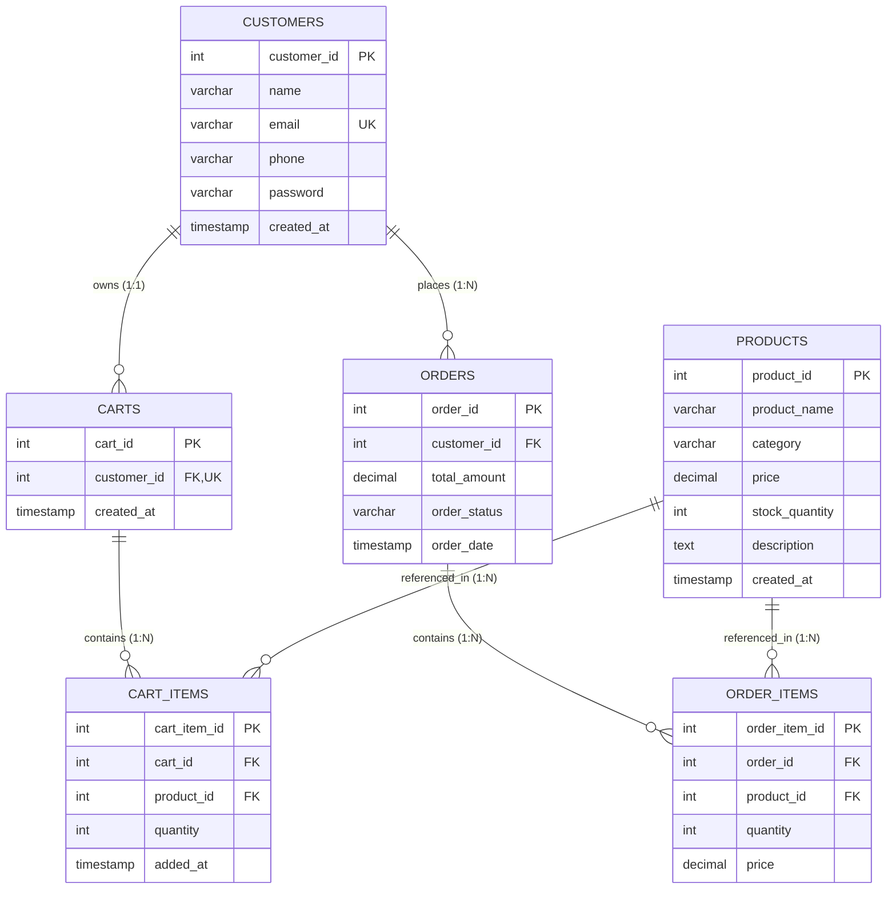

# Smart E-Commerce Backend Engine

> A high-performance, console-based e-commerce backend engine built with **Core Java (Java 17+)**, **MySQL 8+**, **JDBC**, and the **Java Collections Framework**. Designed with clean 3-tier/layered architecture, normalized database design, robust input validation, and ACID-compliant transaction management.

[](https://www.oracle.com/java/)
[](https://www.mysql.com/)
[](https://docs.oracle.com/javase/8/docs/technotes/guides/jdbc/)
[](https://maven.apache.org/)
[](LICENSE)

---

## Overview

**Smart E-Commerce Backend Engine** simulates the core backend workflows of a production e-commerce platform without heavy frameworks (no Spring, no Hibernate). It showcases how enterprise features—such as catalog searches, customer account lifecycle, cart synchronizations, and multi-step transactional checkouts—can be constructed cleanly in Core Java using native JDBC and relational database standards.

This project is tailored as a portfolio project for Java engineers, demonstrating mastery over foundational Object-Oriented Programming (OOP), design patterns, relational data modeling, defensive error handling, and database concurrency.

---

## Features

- **Product Catalog Management**:
  - Full CRUD operations: Create, Read, Update, Delete.
  - Case-insensitive substring search by product name.
  - Category-based filtering across 9 distinct departments.
  - Stock auditing and real-time inventory level checks.
  - Built-in pagination support for catalogs with **500+ product records**.

- **Customer Account Management**:
  - Customer registration with validation (regex-based email, valid phone, non-empty fields).
  - Pre-insert duplicate email prevention.
  - Profile retrieval, updating, and account deletion.
  - Automatic shopping cart provisioning upon registration.

- **Shopping Cart Engine**:
  - 1-to-1 customer-to-cart association.
  - Intelligent upsert: adding an already existing product dynamically increments quantity instead of creating duplicate database records.
  - Strict inventory validation: prevents adding or updating quantities beyond active warehouse stock.
  - Subtotal and total cart price computation.
  - Real-time cart removal and clearing.
  - Efficient $O(1)$ item indexing using `Map<Integer, CartItem>`.

- **Transactional Order Checkout**:
  - **ACID-Compliant JDBC Transactions**: Multi-step checkout runs inside an isolated transaction (`setAutoCommit(false)`).
  - Atomically validates inventory, generates order master records, writes line items, decrements product stock, and empties the cart.
  - Automatic rollback on any failure (insufficient stock, concurrent purchases, SQL errors), leaving database state consistent.
  - Order history tracking and formatted itemized invoice viewing.

---

## Technologies

- **Language**: Java 17+ (Core Java, OOP, Java Collections Framework)
- **Database**: MySQL 8.0+ (InnoDB storage engine, UTF-8 unicode collation)
- **Data Access**: JDBC (Java Database Connectivity) with `PreparedStatement`, `ResultSet`, and `DriverManager`
- **Build Tool**: Apache Maven 3.8+ (also runnable standalone with javac/java)
- **Driver**: `mysql-connector-j` (version 8.3.0)

---

## Architecture

The project adheres to a clean **3-Tier Layered Architecture**, separating concerns and adhering to the Single Responsibility Principle:

```
+-------------------------------------------------------------+
|                     Console UI Layer                        |
|           (ConsoleMenu.java, TableFormatter.java)           |
+------------------------------+------------------------------+
                               | calls
+------------------------------v------------------------------+
|                      Service Layer                          |
|  (ProductService, CustomerService, CartService,             |
|   OrderService [ACID Transaction Boundaries])               |
+------------------------------+------------------------------+
                               | calls
+------------------------------v------------------------------+
|                     Data Access Layer                       |
|  (ProductDAO, CustomerDAO, CartDAO, OrderDAO)               |
|      - PreparedStatements exclusively                       |
|      - Resource management via try-with-resources           |
+------------------------------+------------------------------+
                               | queries
+------------------------------v------------------------------+
|                  MySQL 8 Relational Database                |
|  (customers, products, carts, cart_items, orders,           |
|   order_items)                                              |
+-------------------------------------------------------------+
```

### Layer Roles
1. **Model Layer (`com.ecommerce.model`)**: Pure Domain Objects (POJOs) with encapsulated private state, validation helpers, and monetary representation using `BigDecimal`.
2. **DAO Layer (`com.ecommerce.dao` & `impl`)**: Isolates raw SQL and JDBC code behind clean Java interfaces. Employs `PreparedStatement` parameters to prevent SQL Injection.
3. **Service Layer (`com.ecommerce.service` & `impl`)**: Orchestrates business rules, delegates data access, controls collection transformations, and defines transaction boundaries (`commit`/`rollback`).
4. **Exception Layer (`com.ecommerce.exception`)**: Domain-specific checked and unchecked exceptions for explicit error handling.
5. **Utility Layer (`com.ecommerce.util`)**: Connection management (`DBConnection`), string & format validation (`InputValidator`), and password hashing (`PasswordUtil`).
6. **UI Layer (`com.ecommerce.ui`)**: Interactive CLI menus, paginated listings, and ASCII table generation.

---

## Database Schema

The database is normalized to **Third Normal Form (3NF)** with explicit foreign keys, cascade rules, check constraints, and composite uniqueness constraints.



### Table Descriptions
- `customers`: Stores authenticated shopper credentials and contact details.
- `products`: Catalog items with non-negative stock and positive unit pricing.
- `carts`: One-to-one shopping basket assigned per customer.
- `cart_items`: Line items inside a cart. Has unique constraint `(cart_id, product_id)`.
- `orders`: Master order record containing order date, overall billed amount, and status.
- `order_items`: Line items snapshotting the exact unit price at time of purchase.

---

## Project Structure

```
smart-ecommerce-engine/
│
├── pom.xml                               # Maven Project Descriptor
├── .gitignore                            # Git Exclusion Rules
├── README.md                             # Comprehensive Project Documentation
├── db.properties.example                 # Credentials Configuration Template
├── build_and_run.bat                     # Windows One-Click Build & Run Script
├── run.bat                               # Windows Quick Run Script
├── run_tests.bat                         # Automated Verification Suite Runner
│
├── database/
│   ├── schema.sql                        # Normalized 3NF DDL with Indexes & Constraints
│   └── sample_data.sql                   # 500+ Realistic Products & Seed Customers
│
├── lib/
│   └── mysql-connector-j-8.3.0.jar       # Bundled MySQL JDBC Driver
│
└── src/
    ├── main/
    │   ├── java/
    │   │   └── com/
    │   │       └── ecommerce/
    │   │           ├── Main.java         # Main Application Bootstrapper
    │   │           │
    │   │           ├── model/            # Domain Entities (POJOs)
    │   │           │   ├── Product.java
    │   │           │   ├── Customer.java
    │   │           │   ├── Cart.java
    │   │           │   ├── CartItem.java
    │   │           │   ├── Order.java
    │   │           │   └── OrderItem.java
    │   │           │
    │   │           ├── dao/              # Data Access Interfaces
    │   │           │   ├── ProductDAO.java
    │   │           │   ├── CustomerDAO.java
    │   │           │   ├── CartDAO.java
    │   │           │   ├── OrderDAO.java
    │   │           │   └── impl/         # JDBC DAO Implementations
    │   │           │       ├── ProductDAOImpl.java
    │   │           │       ├── CustomerDAOImpl.java
    │   │           │       ├── CartDAOImpl.java
    │   │           │       └── OrderDAOImpl.java
    │   │           │
    │   │           ├── service/          # Business Logic Interfaces
    │   │           │   ├── ProductService.java
    │   │           │   ├── CustomerService.java
    │   │           │   ├── CartService.java
    │   │           │   ├── OrderService.java
    │   │           │   └── impl/         # Service Implementations & Transactions
    │   │           │       ├── ProductServiceImpl.java
    │   │           │       ├── CustomerServiceImpl.java
    │   │           │       ├── CartServiceImpl.java
    │   │           │       └── OrderServiceImpl.java
    │   │           │
    │   │           ├── exception/        # Domain Custom Exceptions
    │   │           │   ├── ProductNotFoundException.java
    │   │           │   ├── CustomerNotFoundException.java
    │   │           │   ├── InsufficientStockException.java
    │   │           │   ├── InvalidInputException.java
    │   │           │   └── DatabaseException.java
    │   │           │
    │   │           ├── util/             # Utility & Helper Classes
    │   │           │   ├── DBConnection.java
    │   │           │   ├── InputValidator.java
    │   │           │   └── PasswordUtil.java
    │   │           │
    │   │           └── ui/               # Console UI Presentation
    │   │               ├── ConsoleMenu.java
    │   │               └── TableFormatter.java
    │   │
    │   └── resources/
    │       └── db.properties             # Runtime Database Configuration
    │
    └── test/
        └── java/
            └── com/
                └── ecommerce/
                    └── TestPlanVerification.java # Test Suite for Validations & Integration
```

---

## Setup Instructions

### 0. Clone Repository
```bash
git clone https://github.com/Pavan777sp/smart-ecommerce.git
cd smart-ecommerce
```

### 1. Prerequisites
- **Java JDK 17 or higher** installed. Verify with:
  ```bash
  java -version
  javac -version
  ```
- **MySQL Server 8.0 or higher** installed and running. Verify with:
  ```bash
  # Windows Command Prompt (as Administrator):
  net start MySQL80
  ```

### 2. Database Creation & Schema Setup
Open your MySQL CLI client, MySQL Workbench, or PowerShell:

```bash
# Log in to MySQL
mysql -u root -p
```

Execute the database schema script:
```sql
SOURCE /path/to/smart-ecommerce-engine/database/schema.sql;
```
*(On Windows: `SOURCE C:/Users/pavan/.../database/schema.sql;`)*

### 3. Load Sample Data (500+ Realistic Products)
Execute the seed script to populate over 500 products across 9 categories and 10 seed customer accounts:
```sql
SOURCE /path/to/smart-ecommerce-engine/database/sample_data.sql;
```

Verify the records:
```sql
USE smart_ecommerce;
SELECT COUNT(*) FROM products; -- Returns 525
SELECT category, COUNT(*) FROM products GROUP BY category;
```

### 4. Configure Database Credentials
Edit `src/main/resources/db.properties` (or copy from `db.properties.example`):
```properties
db.url=jdbc:mysql://localhost:3306/smart_ecommerce?useSSL=false&allowPublicKeyRetrieval=true&serverTimezone=UTC
db.username=root
db.password=YOUR_MYSQL_PASSWORD
db.driver=com.mysql.cj.jdbc.Driver
```

---

## How to Run

### Option A: Using Maven
```bash
# Build the project
mvn clean compile

# Run the console application
mvn exec:java
```

### Option B: Using the Provided Windows Batch Scripts
- Double-click or execute **`build_and_run.bat`** to compile and run in one step.
- Or execute **`run.bat`** to immediately start the pre-compiled application.

### Option C: Manual Command Line Execution
```bash
# Compile
javac -encoding UTF-8 -d target/classes -cp "lib/mysql-connector-j-8.3.0.jar" src/main/java/com/ecommerce/**/*.java

# Copy configuration
cp src/main/resources/db.properties target/classes/

# Run
java -cp "lib/mysql-connector-j-8.3.0.jar;target/classes" com.ecommerce.Main
```

### Option D: Run in IDE (IntelliJ IDEA / Eclipse / VS Code)
1. Open IDE and choose **Open Project / Import Project**.
2. Select the `smart-ecommerce-engine` folder (contains `pom.xml`).
3. Allow IDE to import dependencies automatically.
4. Locate `com.ecommerce.Main` and click **Run**.

---

## Sample Console Output

### 1. Main Navigation Menu
```text
========================================================================
            SMART E-COMMERCE BACKEND ENGINE (CORE JAVA + JDBC)         
========================================================================
 Version: 1.0.0 | Architecture: 3-Tier Layered (Model-DAO-Service-UI)   
 Technologies: Java 17+, MySQL 8, JDBC PreparedStatements, Collections   
========================================================================

[*] Checking MySQL Database connection...
[✓] Database connection successfully established!

==========================================
       SMART E-COMMERCE SYSTEM            
==========================================
1. Customer Management
2. Product Management
3. Cart Management
4. Order Management
5. Exit
==========================================
Enter your choice: 2
```

### 2. Product Catalog Browsing (with Pagination)
```text
=== PRODUCTS CATALOG (Page 1 of 35 - Showing 1 to 15 of 525) ===
+--------+----------------------------------------+------------------+------------+----------+
| ID     | Product Name                           | Category         |  Price ($) |    Stock |
+--------+----------------------------------------+------------------+------------+----------+
| 1      | Sony Bravia 55" 4K OLED TV             | Electronics      |    1499.99 |       25 |
| 2      | Sony WH-1000XM5 Wireless Headphones    | Electronics      |     399.99 |       80 |
| 3      | Apple iPhone 15 Pro Max 256GB Titanium | Mobiles          |    1199.00 |       45 |
| 4      | Apple MacBook Pro 16" M3 Max 36GB 1TB  | Laptops          |    3499.00 |       15 |
| 5      | Logitech MX Master 3S Wireless Mouse   | Accessories      |      99.99 |      120 |
| 6      | Clean Code by Robert C. Martin         | Books            |      44.99 |       60 |
| 7      | Dyson V15 Detect Cordless Vacuum       | Home Appliances  |     749.99 |       30 |
| 8      | Nike Dri-FIT Men's Training T-Shirt    | Clothing         |      29.99 |      150 |
| 9      | Wilson Evolution Official Basketball   | Sports           |      79.99 |       50 |
| 10     | Sony PlayStation 5 Slim Console 1TB    | Gaming           |     499.99 |       40 |
+--------+----------------------------------------+------------------+------------+----------+
  Total Products: 15
[N]ext Page | [P]revious Page | [Q]uit to Menu | Jump to page (number):
```

### 3. Shopping Cart View
```text
+--------+----------------------------------+------------+----------+--------------+
| PID    | Product Name                     | Unit Price | Quantity | Subtotal ($) |
+--------+----------------------------------+------------+----------+--------------+
| 2      | Sony WH-1000XM5 Headphones       |    $399.99 |        2 |      $799.98 |
| 5      | Logitech MX Master 3S Mouse      |     $99.99 |        1 |       $99.99 |
| 6      | Clean Code by Robert C. Martin   |     $44.99 |        1 |       $44.99 |
+--------+----------------------------------+------------+----------+--------------+
| TOTAL ESTIMATED AMOUNT                                            |      $944.96 |
+-------------------------------------------------------------------+--------------+
```

### 4. Transactional Checkout & Invoice
```text
[⏳] Executing ACID transaction: validating inventory, creating order, updating stock...
[✓] TRANSACTION COMMITTED SUCCESSFULLY!

============================================================
                 OFFICIAL ORDER INVOICE                     
============================================================
 Order ID:      #104
 Customer ID:   #1
 Status:        COMPLETED
 Placed Date:   2026-09-15 21:50:00
------------------------------------------------------------
+--------+------------------------------+--------+------------+------------+
| PID    | Item Name                    |    Qty |      Price |   Subtotal |
+--------+------------------------------+--------+------------+------------+
| 2      | Sony WH-1000XM5 Headphones   |      2 |    $399.99 |    $799.98 |
| 5      | Logitech MX Master 3S Mouse  |      1 |     $99.99 |     $99.99 |
| 6      | Clean Code                   |      1 |     $44.99 |     $44.99 |
+--------+------------------------------+--------+------------+------------+
 TOTAL BILLED:  $944.96
============================================================
```

---

## SQL Optimization

1. **Selective Column Projections**:
   - `SELECT *` is strictly banned in all DAO implementations. Every query specifies only the columns required (e.g. `SELECT product_id, product_name, price, stock_quantity...`).
   - This minimizes network I/O, optimizes buffer cache usage, and prevents deserialization overhead.

2. **Index Strategy**:
   - Indexed `product_name` and `category` in `products` table for fast catalog searches.
   - Indexed `email` with a `UNIQUE` index in `customers` table for instant $O(1)$ customer lookup during authentication.
   - Indexed foreign keys (`customer_id`, `cart_id`, `order_id`, `product_id`) across all tables to optimize table `JOIN` performance.

3. **Optimized SQL JOINs**:
   - Cart retrieval fetches joined product attributes (unit price, product title, available stock) in a single database round-trip using `INNER JOIN products p ON ci.product_id = p.product_id`.
   - Order history and line item details are similarly retrieved using normalized joins.

4. **Atomic Upsert**:
   - Implemented `INSERT INTO cart_items ... ON DUPLICATE KEY UPDATE quantity = quantity + VALUES(quantity)` to eliminate race conditions and avoid separate `SELECT -> INSERT/UPDATE` roundtrips.

5. **PreparedStatement Security & Efficiency**:
   - Every dynamic query uses parameter placeholders (`?`).
   - Pre-compiles SQL plans on the MySQL server, reducing parsing overhead.
   - Guarantees immunity against **SQL Injection Attacks**.

---

## Exception Handling

The system implements clean, defensive exception handling:
- **Zero Empty Catch Blocks**: No suppressed exceptions.
- **Custom Checked Exceptions**:
  - `ProductNotFoundException`: Raised when searching for non-existent product IDs.
  - `CustomerNotFoundException`: Raised when querying or updating non-existent customer accounts.
  - `InsufficientStockException`: Raised when an item quantity exceeds warehouse stock. Stores requested vs available quantities.
  - `InvalidInputException`: Raised by `InputValidator` when user inputs violate syntax or boundary rules.
- **Unchecked System Exception**:
  - `DatabaseException`: Wraps low-level `SQLException` to prevent leaking JDBC details into the presentation layer.
- **Defensive UI Scanners**:
  - `readInt()` and `readBigDecimal()` intercept typing errors (e.g. inputting letters where digits are expected), providing friendly prompts rather than crashing on `InputMismatchException`.

---

## Transaction Management

The checkout process in `OrderServiceImpl` implements strict **ACID Transactions**:

```java
Connection conn = null;
try {
    conn = DBConnection.getConnection();
    conn.setAutoCommit(false); // 1. Begin Transaction Boundary

    // Step 1: Validate stock for all items in cart
    for (CartItem item : cartItems) {
        int stock = productDAO.getStock(item.getProductId());
        if (stock < item.getQuantity()) {
            throw new InsufficientStockException(item.getProductId(), item.getQuantity(), stock);
        }
    }

    // Step 2: Insert Order master record
    int orderId = orderDAO.insertOrder(conn, order);

    // Step 3: Insert Order Items with captured price
    orderDAO.insertOrderItems(conn, orderItems);

    // Step 4: Atomically deduct product stock
    for (CartItem item : cartItems) {
        boolean success = productDAO.deductStock(conn, item.getProductId(), item.getQuantity());
        if (!success) throw new InsufficientStockException(...);
    }

    // Step 5: Clear customer cart
    cartDAO.clearCart(conn, cartId);

    conn.commit(); // 2. Commit All Operations Atomically
} catch (Exception e) {
    if (conn != null) {
        conn.rollback(); // 3. Rollback Everything on Error
    }
    throw e;
} finally {
    if (conn != null) {
        conn.setAutoCommit(true); // 4. Restore Default State
        conn.close();
    }
}
```

---

## Testing & Verification

A dedicated verification test suite is included in `src/test/java/com/ecommerce/TestPlanVerification.java`.

### Executing Tests
```bash
# Run via batch script
run_tests.bat

# Or run directly via Java
java -cp "lib/mysql-connector-j-8.3.0.jar;target/classes;target/test-classes" com.ecommerce.TestPlanVerification
```

### Test Coverage Matrix
| Test Case | Description | Status |
|---|---|---|
| `Reject empty name` | Validates rejection of blank names | Passed |
| `Reject invalid email format` | Validates regex rejection of invalid emails | Passed |
| `Accept valid email format` | Accepts well-formed email addresses | Passed |
| `Reject short phone number` | Ensures phone contains 10-15 digits | Passed |
| `Accept valid phone number` | Accepts valid telephone digits | Passed |
| `Reject zero/negative price` | Enforces price > 0.00 | Passed |
| `Reject negative stock` | Enforces stock >= 0 | Passed |
| `Reject zero quantity` | Enforces cart quantity > 0 | Passed |
| `Map<Integer, CartItem> indexing` | Verifies $O(1)$ cart lookup by Product ID | Passed |
| `Set<Integer> uniqueness` | Verifies Set deduplication of Product IDs | Passed |
| `Cart total arithmetic` | Verifies precision calculation of subtotals and totals | Passed |
| `Database Integration` | End-to-end checkout, stock deduction, and cart clearing | Verified on MySQL |

---

## Future Enhancements

- Introduce **Connection Pooling** with HikariCP to support thousands of concurrent requests.
- Implement **JWT Token Authentication** or Session Tokens for customer login state.
- Add **Discount Coupon / Voucher Service** applied during checkout.
- Expose RESTful endpoints using **Spring Boot** or **JAX-RS** while preserving the underlying DAO/Service architecture.
- Integrate payment gateway webhook simulation (Stripe / Razorpay).
